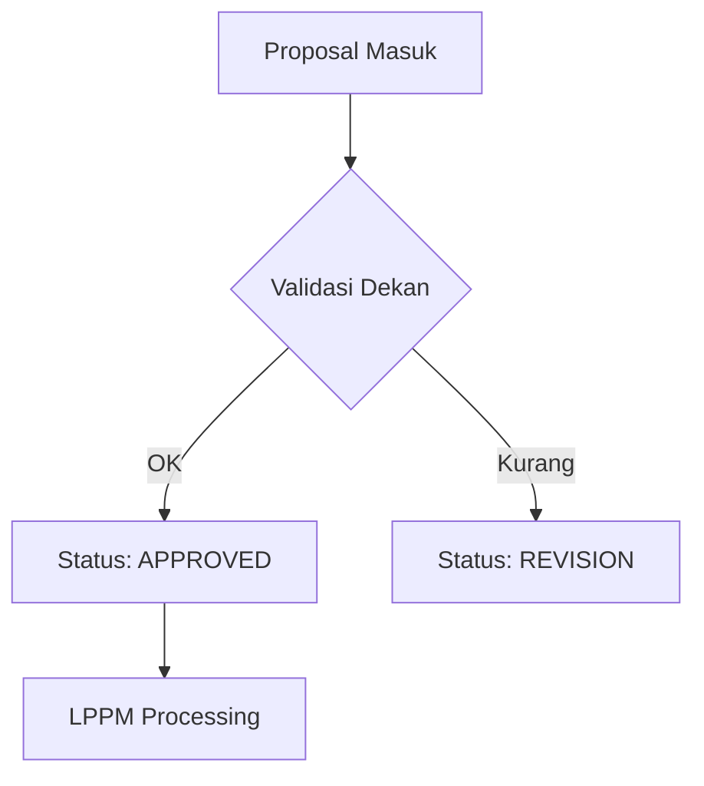

# Panduan Pengguna: Dekan
## SIM LPPM ITSNU – "The Accountant of Research"

---

## Bab 1: Pendahuluan
Sebagai Dekan, tugas utama Anda adalah melakukan validasi awal terhadap usulan penelitian dan pengabdian masyarakat dari fakultas Anda. Peran ini memastikan kualitas dan keselarasan riset dengan visi fakultas.

---

## Bab 2: Memulai (Getting Started)

### Akses & Login
1.  Buka browser dan masuk ke URL sistem.
2.  Login menggunakan akun Dekan Anda.
3.  Dashboard akan menampilkan statistik usulan masuk dari fakultas Anda.

### Antarmuka (UI Tour)

- **Menu Persetujuan**: Menampilkan daftar proposal yang perlu divalidasi.
- **Monitoring Luaran**: Data capaian riset fakultas.

---

## Bab 3: Panduan Fitur

### 3.1 Memproses Usulan Masuk (Approval)
1.  Buka menu **Persetujuan Dekan**.
2.  Klik ikon **Detail** pada proposal berstatus `SUBMITTED`.
3.  Periksa kelengkapan berkas dan kesesuaian tim.
4.  Klik tombol aksi:
    - **Setuju (Approve)**: Meneruskan ke LPPM.
    - **Revisi**: Mengembalikan ke Dosen untuk diperbaiki.
    - **Tolak**: Menghentikan proses proposal.

### 3.2 Alur Validasi

---

## Bab 4: Troubleshooting & FAQ
- **T: Mengapa saya tidak bisa melihat proposal dosen tertentu?**
  J: Pastikan dosen tersebut memilih Fakultas yang sesuai dengan jabatan Anda saat mengisi identitas proposal.
- **T: Data luaran fakultas kosong?**
  J: Data luaran hanya muncul jika dosen sudah mengunggah bukti dan diverifikasi oleh Admin.

---

## Lampiran
### Glosarium
- **Approved**: Disetujui ditingkat fakultas.
- **Revision**: Perlu perbaikan teknis/substansi.

---
*"Efisiensi adalah tujuan, tapi Integritas adalah fondasi kita."*
