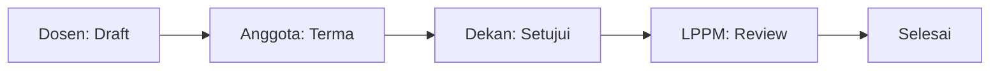

# Panduan Pengguna: Dosen
## SIM LPPM ITSNU – "The Accountant of Research"

---

## Bab 1: Pendahuluan
Sistem Informasi Manajemen LPPM (SIM LPPM) adalah platform digital untuk memfasilitasi riset dan pengabdian dosen secara transparan. Sebagai Dosen, sistem ini membantu Anda mengelola hibah dari awal hingga akhir tanpa beban administrasi manual.

### Fitur Utama:
- Pengusulan proposal mandiri & kolaborasi tim.
- Monitoring status review secara real-time.
- Pelaporan Catatan Harian (Logbook) & Luaran (Output).

---

## Bab 2: Memulai (Getting Started)

### Akses & Login
1.  Buka browser Anda dan akses URL: `http://127.0.0.1:8000` (atau URL institusi).
2.  Masukkan **Username** dan **Password** Anda.
3.  Klik tombol **Login**. Jika lupa password, hubungi Admin LPPM.

### Antarmuka (UI Tour)

- **Sidebar**: Navigasi ke menu Proposal, Laporan, dan Profil.
- **Card Stats**: Ringkasan jumlah proposal Anda.

---

## Bab 3: Panduan Fitur
Bagian ini menjelaskan langkah-langkah praktis untuk tugas Anda.

### 3.1 Mengajukan Proposal Baru
1.  Buka menu **Proposal Saya** lalu klik **Tambah Baru**.
2.  **Langkah 1 (Skema)**: Pilih kategori 'Penelitian' atau 'PKM'.
3.  **Langkah 2 (Tim)**: Masukkan nama anggota tim.
    - *Tips: Pastikan anggota tim Anda sudah masuk ke sistem untuk menyetujui undangan.*
4.  **Langkah 3 (Substansi)**: Unggah file proposal dalam format PDF.
5.  **Langkah 4 (Anggaran)**: Isi rincian biaya. Jika melebihi batas (Budget Cap), sistem akan memberi peringatan.
6.  Klik **Submit** jika semua sudah lengkap.

### 3.2 Alur Persetujuan

---

## Bab 4: Troubleshooting & FAQ
- **T: Kenapa tombol Submit tidak muncul?**
  J: Pastikan semua anggota tim yang Anda undang sudah menekan tombol "Terima" di dashboard mereka.
- **T: Batas Anggaran terlampaui?**
  J: Setiap skema memiliki batas dana maksimal. Kurangi nilai RAB Anda agar sesuai dengan plafon yang berlaku.

---

## Lampiran
### Glosarium
- **TKT**: Tingkat Kesiapan Teknologi (0-9).
- **Luaran Wajib**: Hasil riset yang harus dipenuhi (misal: Jurnal).
- **Daily Note**: Catatan kegiatan berkala.

---
*"Efisiensi adalah tujuan, tapi Integritas adalah fondasi kita."*
