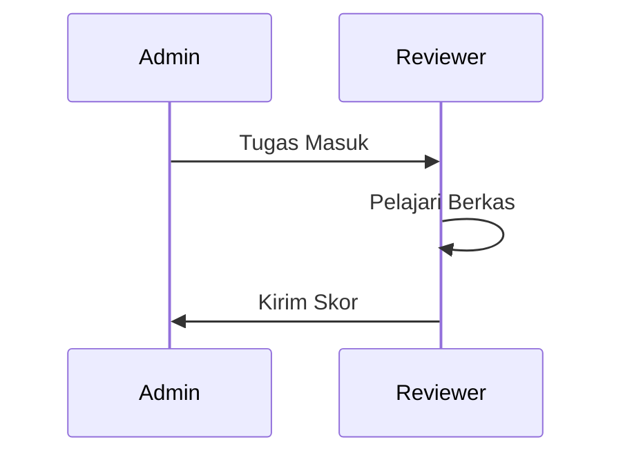

# Panduan Pengguna: Reviewer
## SIM LPPM ITSNU – "The Accountant of Research"

---

## Bab 1: Pendahuluan
Reviewer adalah pakar yang dipercaya untuk memberikan penilaian objektif terhadap substansi akademik proposal. Penilaian Anda menjadi dasar utama keputusan pendanaan hibah di ITSNU.

---

## Bab 2: Memulai (Getting Started)

### Akses & Login
1.  Login ke sistem menggunakan kredensial Reviewer.
2.  Cek menu **Tugas Review** untuk melihat daftar antrean penilaian.

### Antarmuka (UI Tour)

- **Kriteria Penilaian**: Form digital dengan skor 0-10.
- **Catatan**: Kolom masukan untuk pengusul.

---

## Bab 3: Panduan Fitur

### 3.1 Melakukan Review Proposal
1.  Klik tombol **Review** pada proposal yang ditugaskan.
2.  Pelajari draf proposal melalui link yang tersedia.
3.  Isi skor untuk setiap kriteria (Metodologi, Kebaruan, dll).
4.  Tuliskan masukan kualitatif di kolom **Catatan Reviewer**.
5.  Pilih **Rekomendasi**: Setujui, Revisi, atau Tolak.
6.  Klik **Kirim Penilaian**.

### 3.2 Timeline Review

---

## Bab 4: Troubleshooting & FAQ
- **T: Link proposal tidak bisa dibuka?**
  J: Pastikan browser Anda mengizinkan pop-up atau periksa koneksi internet Anda.
- **T: Status tetap "In Progress" meski sudah diisi?**
  J: Pastikan Anda sudah menekan tombol **Kirim/Submit** di bagian bawah form.

---

## Lampiran
### Glosarium
- **Scoring**: Pemberian nilai numerik (1-10).
- **Rekomendasi Pakar**: Masukan akhir reviewer (Layak/Tidak Layak).

---
*"Efisiensi adalah tujuan, tapi Integritas adalah fondasi kita."*
